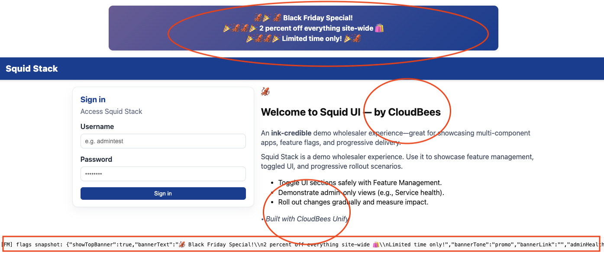

# 🦑 SquidStack

**SquidStack** is a demo **microservices e-commerce application** with a marine theme.

It showcases:
- Microservice architecture patterns
- JWT-based authentication and role-based access control (RBAC)
- Feature management with CloudBees Unify
- Database-per-service pattern with PostgreSQL and Liquibase migrations
- API Gateway pattern with nginx reverse proxy
- Comprehensive CI/CD with CloudBees workflows

👉 [Jump to CloudBees Unify Integration](#-cloudbees-unify-integration)
👉 [Jump to What We've Built](#-what-weve-built-so-far)
👉 [Jump to What's Planned](#-whats-next-implementation-roadmap)

---

## 🌊 Components Overview

| Service | Status | Purpose | Database | API Port |
|---------|--------|---------|----------|----------|
| [squid-ui](https://github.com/cb-squidstack/squid-ui/blob/main/README.md) | ✅ **Fully Implemented** | React frontend with nginx API gateway | No | 80/443 (external) |
| [kraken-auth](https://github.com/cb-squidstack/kraken-auth/blob/main/README.md) | ✅ **Fully Implemented** | Authentication, JWT, user/role mgmt, admin CRUD | **Yes** (`auth`, `public`) | 8080 |
| [clam-catalog](https://github.com/cb-squidstack/clam-catalog/blob/main/README.md) | ✅ **Fully Implemented** | Product catalog with stock management | **Yes** (`catalog`) | 8080 |
| [codlocker-assets](https://github.com/cb-squidstack/codlocker-assets/blob/main/README.md) | ✅ **Fully Implemented** | Static asset server (55 product images) | No | 8080 |
| [barnacle-reviews](https://github.com/cb-squidstack/barnacle-reviews/blob/main/README.md) | ⚠️ **Stub** - 🔥 Next Priority | Product reviews/ratings | **Planned** (`reviews`) | 8080 |
| [cuttlefish-orders](https://github.com/cb-squidstack/cuttlefish-orders/blob/main/README.md) | ⚠️ **Stub** - Second Priority | Order processing and lifecycle | **Planned** (`orders`) | 8080 |
| [octopus-payments](https://github.com/cb-squidstack/octopus-payments/blob/main/README.md) | ⚠️ **Stub** - Future | Payment simulation (178 tests) | No | 8080 |
| [urchin-analytics](https://github.com/cb-squidstack/urchin-analytics/blob/main/README.md) | ⚠️ **Stub** - Future | User behavior/event tracking | **Planned** (`analytics`) | 8080 |
| [squid-recommendations](https://github.com/cb-squidstack/squid-recommendations/blob/main/README.md) | ⚠️ **Stub** - Future | Product recommendations | No | 8080 |
| [jellyfish-notifications](https://github.com/cb-squidstack/jellyfish-notifications/blob/main/README.md) | ⚠️ **Stub** - Future | Email/SMS/in-app notifications | No | 8083 |
| [manta-delivery](https://github.com/cb-squidstack/manta-delivery/blob/main/README.md) | ⚠️ **Stub** - Future | Delivery tracking and logistics | No | 8080 |
| [nautilus-inventory](https://github.com/cb-squidstack/nautilus-inventory/blob/main/README.md) | ❌ **Not Used** | Stock management (consolidated into clam-catalog) | N/A | 8084 |

**Legend:**
- ✅ **Fully Implemented** - Complete business logic, database, tests, CI/CD
- ⚠️ **Stub** - Infrastructure and health checks only, no business logic
- ❌ **Not Used** - Originally planned but not used in current architecture

---

## 💡 What We've Built So Far

### ✅ Fully Implemented Services

#### 1. **kraken-auth** - Authentication & User Management
- **JWT-based authentication** with HS256 signing
- **Role-based access control** (RBAC) with roles: user, admin, storeadmin, betauser, betaadmin
- **Complete user CRUD operations** (admin only):
  - Create users with username, password, profile, and roles
  - Update user profiles (name, email, phone, address, country)
  - Manage user roles (add/remove)
  - Reset user passwords
- **Database-driven country validation** (201 countries from PostgreSQL)
- **Liquibase migrations** with idempotent seed data
- **80+ comprehensive tests** covering all endpoints and business logic
- **Endpoints**: `/login`, `/admin/users`, `/admin/roles`, `/admin/countries`, health checks

#### 2. **clam-catalog** - Product Catalog & Stock Management
- **Product CRUD operations** with JWT authorization for admin
- **55 seeded products** across 5 categories (Electronics, Clothing, Home, Sports, Books)
- **Stock management** consolidated here (`stock_count` field) - no separate inventory service
- **Product fields**: name, description, price, images[], category, SKU, stock_count, tags[], rating, review_count
- **Public read endpoints** (no auth required) for browsing
- **Protected admin endpoints** for create/update/delete operations
- **Pagination and filtering** support
- **Liquibase migrations** with CSV seed data
- **55+ comprehensive tests**
- **Integration**: Product images served via codlocker-assets

**Architecture decision**: Stock management was consolidated into clam-catalog for simplicity. The originally planned `nautilus-inventory` service is not used.

#### 3. **codlocker-assets** - Static Asset Server
- **Serves product images** and static files
- **55 placeholder SVG images** bundled in container (organized by category)
- **Storage abstraction layer** (local filesystem, future: S3/GCS)
- **Content-Type detection** and caching headers
- **Path traversal protection**
- **50+ comprehensive tests**
- **Endpoints**: `/assets/*` (product images), health checks

#### 4. **squid-ui** - React Frontend & API Gateway
- **React 18 frontend** with CloudBees Feature Management (Rox) integration
- **API Gateway pattern**: nginx reverse proxy routes all `/api/*` requests to backend services
- **No direct backend access**: All services are internal-only, UI is sole external entry point
- **Authentication flow**: Login, JWT storage, auto-logout on token expiry
- **Admin features**:
  - **User Admin** (full CRUD): Create, edit, delete users; manage roles; reset passwords
  - **Service Health** dashboard (admin only, flag-gated)
  - Database-driven country dropdown (201 countries)
- **Product catalog browsing** with categories and filtering
- **Feature flag integration**: Dynamic UI control (banners, admin sections, company branding, etc.)
- **62+ comprehensive tests** (React components, API clients)
- **nginx configuration**: Runtime DNS resolution with Kubernetes service discovery

**Key architectural element**: squid-ui is the **only service with external ingress**. All backend calls flow through its nginx reverse proxy, eliminating CORS concerns.

### 🧪 Test Coverage

All implemented services include comprehensive test suites:
- **Infrastructure tests**: Logger, middleware, HTTP handlers, routing
- **Business logic tests**: Authentication, JWT, password hashing, CRUD operations
- **Integration tests**: End-to-end API tests with mocked dependencies
- **Code coverage**: 80-100% on most packages

Test results and coverage reports published to **CloudBees Unify** evidence for every workflow run.

---

## 🚀 What's Next: Implementation Roadmap

### 🔥 Priority 1: **barnacle-reviews** (Next Implementation)

Product review and rating service - **scheduled for implementation next**.

**Why implement this first:**
1. **Simple scope**: Straightforward CRUD operations with clear business logic
2. **Immediate value**: Product reviews significantly enhance the e-commerce experience
3. **No complex dependencies**: Only requires auth and catalog (both already implemented)
4. **Visual impact**: Users can immediately see and interact with reviews in the UI
5. **Patterns established**: Can reuse database/Liquibase patterns from kraken-auth

**Planned features:**
- User-submitted product reviews with 1-5 star ratings
- Review voting (helpful/not helpful)
- Moderation tools for admin users
- Aggregate rating updates to clam-catalog
- Review filtering and sorting

**Database**: PostgreSQL with `reviews` schema
**Tables**: `reviews`, `review_votes`, `review_flags`

---

### Priority 2: **cuttlefish-orders** (Second Implementation)

Order processing and lifecycle management.

**Planned features:**
- Order creation from shopping cart
- Order status tracking (pending, processing, shipped, delivered, cancelled)
- Order history for customers
- Admin order management
- Stock deduction in clam-catalog when orders placed
- Payment simulation (initially mocked, later integrated with octopus-payments)

**Dependencies**: kraken-auth (complete), clam-catalog (complete)
**Database**: PostgreSQL with `orders` schema
**Tables**: `orders`, `order_items`, `order_events`, `order_payments`

---

### Future Implementations (Supporting Services)

**After reviews and orders are operational**, these supporting services can be implemented:

- **octopus-payments**: Payment simulation/mocking (has 178 tests already)
- **jellyfish-notifications**: Email/SMS notifications for order status changes
- **manta-delivery**: Shipping tracking and delivery estimates
- **urchin-analytics**: User behavior tracking and engagement metrics
- **squid-recommendations**: Product recommendations based on behavior/purchases

---

### ❌ Not Planned for Implementation

- **nautilus-inventory**: Stock management consolidated into clam-catalog. This service will remain a stub unless complex multi-warehouse requirements emerge.

---

## 📐 Architecture

### 🌐 Key Architectural Pattern: API Gateway (Not Service Mesh)

**SquidStack uses an API Gateway pattern**, not a service mesh. All backend services are internal-only and accessed through the squid-ui nginx reverse proxy.

```
┌─────────────────────────────────────────────────────────────────┐
│                                                                 │
│  External Traffic (HTTPS)                                       │
│  └─> squid-ui Ingress (ONLY external-facing service)           │
│                                                                 │
└────────────────────────────────┬────────────────────────────────┘
                                 │
                                 ▼
┌─────────────────────────────────────────────────────────────────┐
│  squid-ui Pod                                                   │
│  ┌──────────────────────────────────────────────────────────┐  │
│  │  NGINX (API Gateway / Reverse Proxy)                     │  │
│  │  • Routes /api/kraken-auth/* → kraken-auth:8080          │  │
│  │  • Routes /api/clam-catalog/* → clam-catalog:8080        │  │
│  │  • Routes /assets/* → codlocker-assets:8080              │  │
│  │  • Serves React SPA from /usr/share/nginx/html           │  │
│  │  • Runtime DNS resolution (lazy lookup via variables)    │  │
│  └──────────────────────────────────────────────────────────┘  │
└─────────────────────────────────────────────────────────────────┘
                                 │
              ┌──────────────────┼──────────────────┐
              ▼                  ▼                  ▼
    ┌─────────────────┐ ┌─────────────────┐ ┌─────────────────┐
    │ kraken-auth     │ │ clam-catalog    │ │ codlocker-assets│
    │ (internal only) │ │ (internal only) │ │ (internal only) │
    │ Port: 8080      │ │ Port: 8080      │ │ Port: 8080      │
    │ No external     │ │ No external     │ │ No external     │
    │ ingress         │ │ ingress         │ │ ingress         │
    └─────────────────┘ └─────────────────┘ └─────────────────┘
```

**Key Points:**
- **Zero service-to-service HTTP calls**: Services do not call each other directly (yet)
- **All traffic flows through nginx**: Browser → nginx → backend service
- **No CORS issues**: Same-origin requests via nginx proxy
- **Kubernetes service discovery**: nginx uses DNS with runtime resolution
- **Future service calls**: When cuttlefish-orders needs clam-catalog, it will call it directly (not through nginx)

### 📊 Service Overview

```
FULLY IMPLEMENTED SERVICES
─────────────────────────────────────────────────────────────────

┌─────────────────────────────────────────────────────────────────┐
│  squid-ui (React + NGINX API Gateway)                          │
│  • External ingress: HTTPS on port 80/443                      │
│  • React 18 frontend with feature flags                        │
│  • Proxies all /api/* requests to backend services             │
│  • Admin UI: User CRUD, Service Health                         │
└─────────────────────────────────────────────────────────────────┘

┌─────────────────────────────────────────────────────────────────┐
│  kraken-auth (Auth + User Management)                          │
│  PostgreSQL Schemas: auth, public                              │
│  Tables:                                                       │
│   • users (id, username, timestamps)                           │
│   • auth_credentials (password hashes)                         │
│   • user_profiles (full_name, email, phone, address,          │
│                     country_code, roles[])                     │
│   • countries (201 countries: code, name, restricted, can_ship)│
│   • roles (user, admin, storeadmin, betauser, betaadmin)       │
│                                                                │
│  Features:                                                     │
│   • JWT issuance with HS256 signing                           │
│   • User CRUD (create, update profile, manage roles, reset pw)│
│   • Database-driven country dropdown                           │
└─────────────────────────────────────────────────────────────────┘

┌─────────────────────────────────────────────────────────────────┐
│  clam-catalog (Product Catalog + Stock)                        │
│  PostgreSQL Schema: catalog                                    │
│  Tables:                                                       │
│   • products (id, name, description, price, images[],         │
│               category, sku, stock_count, tags[], rating,     │
│               review_count, timestamps)                        │
│                                                                │
│  Features:                                                     │
│   • 55 seeded products (5 categories)                         │
│   • Public read endpoints (no auth)                           │
│   • Admin write endpoints (JWT required)                      │
│   • Stock management (replaces nautilus-inventory)            │
│   • Pagination and category filtering                         │
└─────────────────────────────────────────────────────────────────┘

┌─────────────────────────────────────────────────────────────────┐
│  codlocker-assets (Static Asset Server)                        │
│  • 55 SVG product images bundled in container                 │
│  • Storage abstraction (local, future: S3/GCS)                │
│  • Serves /assets/* with proper Content-Type                  │
└─────────────────────────────────────────────────────────────────┘


STUB SERVICES (Health checks only, no business logic)
─────────────────────────────────────────────────────────────────

🔥 barnacle-reviews (NEXT PRIORITY)
   • Product reviews and ratings
   • Planned DB: reviews schema

🥈 cuttlefish-orders (SECOND PRIORITY)
   • Order processing and lifecycle
   • Planned DB: orders schema

Future: octopus-payments, urchin-analytics, squid-recommendations,
        jellyfish-notifications, manta-delivery

❌ NOT USED: nautilus-inventory (stock consolidated into clam-catalog)
```

---

## 🔑 Key Design Principles & Architectural Decisions

### 1. API Gateway Pattern (Not Service Mesh)
- **squid-ui is the ONLY external-facing service** with ingress
- All backend services are internal-only (ClusterIP services)
- nginx in squid-ui proxies all `/api/*` requests to backend services
- Zero CORS configuration needed (same-origin requests via proxy)
- Kubernetes DNS with runtime resolution using nginx variables

### 2. Separation of Concerns
- Each service owns its domain (auth, catalog, reviews, orders)
- Services have clear, focused responsibilities
- No business logic duplication across services

### 3. Database Per Service
- Each service with a database owns its PostgreSQL schema
- kraken-auth: `auth` and `public` schemas
- clam-catalog: `catalog` schema
- Future: barnacle-reviews (`reviews`), cuttlefish-orders (`orders`)
- squid-ui is stateless (JWT + user snapshot in browser localStorage only)

### 4. JWT-Based Security (Shared Secret)
- All services share the same `JWT_SECRET` for token validation
- kraken-auth issues tokens, other services validate them
- Algorithm: HS256 (HMAC with SHA-256)
- Claims: `sub` (user ID), `name` (username), `roles[]`, `exp`, `iat`
- Token lifespan: 24 hours by default

### 5. Liquibase for Schema Management
- All database schemas managed via Liquibase migrations
- Idempotent changesets (safe to reapply)
- Seed data loaded from CSV files
- Migration runs automatically during deployment (Kubernetes Job)

### 6. Stock Management Consolidated
- **Architectural decision**: Stock management is in clam-catalog (`stock_count` field)
- Originally planned separate `nautilus-inventory` service NOT used
- Simplifies architecture by reducing service dependencies
- Future orders will update clam-catalog stock directly

### 7. Feature Management with CloudBees Unify
- Feature flags control UI visibility and behavior
- Flags: `adminUsers`, `adminHealth`, `showTopBannerEnhanced`, `logLevel`, etc.
- User context passed to flags (roles, country, email, etc.)
- Flag changes apply immediately without redeployment

### 8. Comprehensive Testing
- 80-100% code coverage on infrastructure and business logic
- Test types: Unit, integration, HTTP handler, middleware
- Results published to CloudBees Unify evidence on every run

### 9. Deployment Strategy
- **Branch-based environments**:
  - Non-main branches → `squid-dev`
  - Main branch → `squid-preprod` → `squid-prod` (with approval gates)
- Helm charts with shared reusable workflow templates
- Database migrations run automatically before service deployment
- Feature flags enable gradual rollout and A/B testing

---

## 🚀 CloudBees Unify Integration

SquidStack uses **CloudBees Unify** to drive consistent CI/CD workflows across services.  
This is one of the key goals of the project — to **showcase Unify in action**.

### 🔑 How we use Unify

- **Workflow templates**:  
  Shared templates used by `squid-ui` and `kraken-auth` (and future services).  
  Define standard jobs for build, test, deploy, and Liquibase rollout.

- **Actions**:  
  Standard CloudBees actions are called for container builds, Kubernetes deploys, and database migrations.

- **Secrets & Parameters**:  
  Workflows use secrets and params to conditionally enable steps (e.g., Liquibase rollout for DB services, skipped for frontend-only).

---

### 📜 Example — workflow calling a template
#### No database, same workflow

```# Reusable template call (same template, different params per environment)

jobs:
  # --- DEV: any non-main branch ---
  deployDev:
    if: ${{ cloudbees.scm.branch != 'main' }}
    environment: squid-dev
    uses: github.com/cb-squidstack/cb-squidstack/.cloudbees/workflows/deploy-generic.yaml@main
    needs: [build-container-image, test]
    with:
      component_name: squid-ui
      environment_name: squid-dev
      docker_repo: ${{ vars.DOCKER_USER }}/squid-ui
      artifact_id: ${{ needs.build-container-image.outputs.PRIMARY_ARTIFACT_ID }}
      version: ${{ needs.build-container-image.outputs.VERSION }}
      commit_sha: ${{ cloudbees.scm.sha }}
      hostname: squid-dev.guru-rep.sa-demo.beescloud.com
      feature_flags_enabled: "true"
    secrets:
      kubeconfig_secret: ${{ secrets.kubeconfig_squid_dev }}
      FM_KEY_SECRET: ${{ secrets.FM_KEY }}

  # --- PREPROD: main branch (gates prod) ---
  deployPreProd:
    if: ${{ cloudbees.scm.branch == 'main' }}
    environment: squid-preprod
    uses: github.com/cb-squidstack/cb-squidstack/.cloudbees/workflows/deploy-generic.yaml@main
    needs: [build-container-image, test]
    with:
      component_name: squid-ui
      environment_name: squid-preprod
      docker_repo: ${{ vars.DOCKER_USER }}/squid-ui
      artifact_id: ${{ needs.build-container-image.outputs.PRIMARY_ARTIFACT_ID }}
      version: ${{ needs.build-container-image.outputs.VERSION }}
      commit_sha: ${{ cloudbees.scm.sha }}
      hostname: squid-preprod.guru-rep.sa-demo.beescloud.com
      feature_flags_enabled: "true"
    secrets:
      kubeconfig_secret: ${{ secrets.kubeconfig_squid_dev }}
      FM_KEY_SECRET: ${{ secrets.FM_KEY }}

  # --- PROD: main branch + depends on preprod ---
  deployProd:
    if: ${{ cloudbees.scm.branch == 'main' }}
    environment: squid-prod
    uses: github.com/cb-squidstack/cb-squidstack/.cloudbees/workflows/deploy-generic.yaml@main
    needs: [build-container-image, test, deployPreProd]  # ensure preprod first
    with:
      component_name: squid-ui
      environment_name: squid-prod
      docker_repo: ${{ vars.DOCKER_USER }}/squid-ui
      artifact_id: ${{ needs.build-container-image.outputs.PRIMARY_ARTIFACT_ID }}
      version: ${{ needs.build-container-image.outputs.VERSION }}
      commit_sha: ${{ cloudbees.scm.sha }}
      hostname: squid.guru-rep.sa-demo.beescloud.com
      feature_flags_enabled: "true"
    secrets:
      kubeconfig_secret: ${{ secrets.kubeconfig_squid_dev }}
      FM_KEY_SECRET: ${{ secrets.FM_KEY }}
```
#### Database and Liquibase, same workflow

```# Same reusable template, but this time we enable Postgres + Liquibase.
# Branch logic still chooses the environment; params switch on DB rollout.

jobs:
  # --- DEV: any non-main branch ---
  deployDev:
    if: ${{ cloudbees.scm.branch != 'main' }}
    environment: squid-dev
    uses: github.com/cb-squidstack/cb-squidstack/.cloudbees/workflows/deploy-generic.yaml@main
    needs: [build-container-image, test]
    with:
      component_name: kraken-auth
      environment_name: squid-dev
      docker_repo: ${{ vars.DOCKER_USER }}/kraken-auth
      artifact_id: ${{ needs.build-container-image.outputs.PRIMARY_ARTIFACT_ID }}
      version: ${{ needs.build-container-image.outputs.VERSION }}
      commit_sha: ${{ cloudbees.scm.sha }}
      uses_postgres: "true"      # <— DB on
      uses_liquibase: "true"     # <— migrations on
    secrets:
      kubeconfig_secret: ${{ secrets.kubeconfig_squid_dev }}
      JWT_SECRET: ${{ secrets.JWT_SECRET }}
      db_password: ${{ secrets.KRAKEN_DB_PASSWORD }}
      FM_KEY_SECRET: ${{ secrets.FM_KEY }}

  # --- PREPROD: main branch (gates prod) ---
  deployPreProd:
    if: ${{ cloudbees.scm.branch == 'main' }}
    environment: squid-preprod
    uses: github.com/cb-squidstack/cb-squidstack/.cloudbees/workflows/deploy-generic.yaml@main
    needs: [build-container-image, test]
    with:
      component_name: kraken-auth
      environment_name: squid-preprod
      docker_repo: ${{ vars.DOCKER_USER }}/kraken-auth
      artifact_id: ${{ needs.build-container-image.outputs.PRIMARY_ARTIFACT_ID }}
      version: ${{ needs.build-container-image.outputs.VERSION }}
      commit_sha: ${{ cloudbees.scm.sha }}
      uses_postgres: "true"
      uses_liquibase: "true"
    secrets:
      kubeconfig_secret: ${{ secrets.kubeconfig_squid_preprod }}
      JWT_SECRET: ${{ secrets.JWT_SECRET }}
      db_password: ${{ secrets.KRAKEN_DB_PASSWORD }}
      FM_KEY_SECRET: ${{ secrets.FM_KEY }}

  # --- PROD: main branch + depends on preprod ---
  deployProd:
    if: ${{ cloudbees.scm.branch == 'main' }}
    environment: squid-prod
    uses: github.com/cb-squidstack/cb-squidstack/.cloudbees/workflows/deploy-generic.yaml@main
    needs: [build-container-image, test, deployPreProd]
    with:
      component_name: kraken-auth
      environment_name: squid-prod
      docker_repo: ${{ vars.DOCKER_USER }}/kraken-auth
      artifact_id: ${{ needs.build-container-image.outputs.PRIMARY_ARTIFACT_ID }}
      version: ${{ needs.build-container-image.outputs.VERSION }}
      commit_sha: ${{ cloudbees.scm.sha }}
      uses_postgres: "true"
      uses_liquibase: "true"
    secrets:
      kubeconfig_secret: ${{ secrets.kubeconfig_squid_prod }}
      JWT_SECRET: ${{ secrets.JWT_SECRET }}
      db_password: ${{ secrets.KRAKEN_DB_PASSWORD }}
      FM_KEY_SECRET: ${{ secrets.FM_KEY }}

```

---

### 📸 Screenshots

- **Workflow overview in CloudBees Unify**  
  

- **Code snippet using a workflow template**  
 

- **Frontend deployment (squid-ui) flags mainly off**  
  

- **Frontend deployment (squid-ui) flags mainly on**  
  

---

### ✅ Benefits

- **Consistency**: All services follow the same CI/CD pattern.  
- **Flexibility**: Params control optional stages (e.g., skip DB rollout for UI).  
- **Security**: Secrets managed centrally in Unify.  
- **Traceability**: Deployments & rollouts visible in Unify dashboards.  

---

## 📎 Related Docs

Each service has its own README:

- [kraken-auth](https://github.com/cb-squidstack/kraken-auth/blob/main/README.md)
- [squid-ui](https://github.com/cb-squidstack/squid-ui/blob/main/README.md)
- [codlocker-assets](https://github.com/cb-squidstack/codlocker-assets/blob/main/README.md)
- [cuttlefish-orders](https://github.com/cb-squidstack/cuttlefish-orders/blob/main/README.md)
- [octopus-payments](https://github.com/cb-squidstack/octopus-payments/blob/main/README.md)
- [clam-catalog](https://github.com/cb-squidstack/clam-catalog/blob/main/README.md)
- [barnacle-reviews](https://github.com/cb-squidstack/barnacle-reviews/blob/main/README.md)
- [squid-recommendations](https://github.com/cb-squidstack/squid-recommendations/blob/main/README.md)
- [nautilus-inventory](https://github.com/cb-squidstack/nautilus-inventory/blob/main/README.md)
- [urchin-analytics](https://github.com/cb-squidstack/urchin-analytics/blob/main/README.md)
- [jellyfish-notifications](https://github.com/cb-squidstack/jellyfish-notifications/blob/main/README.md)
- [manta-delivery](https://github.com/cb-squidstack/manta-delivery/blob/main/README.md)

