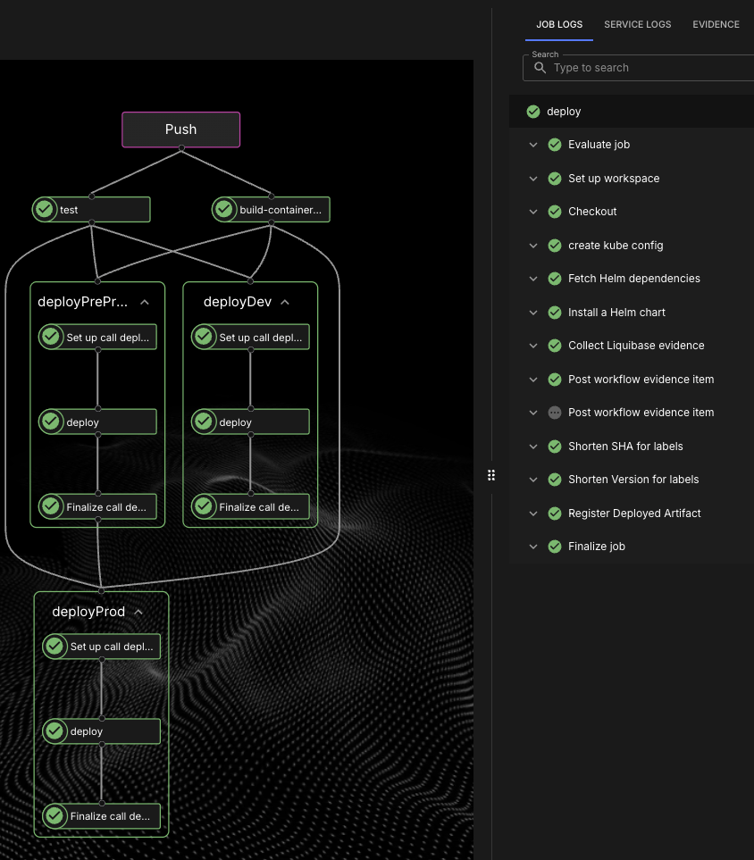
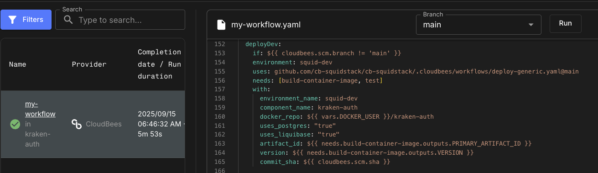
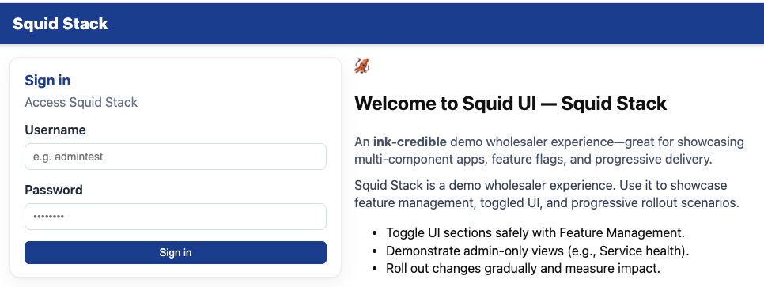
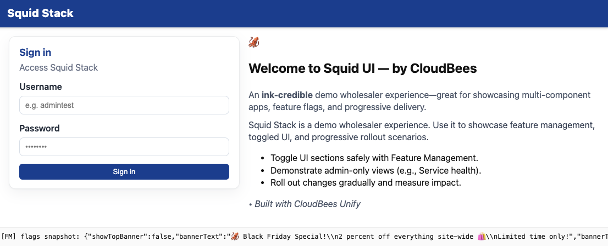

# 🦑 SquidStack

SquidStack is a demo **microservices application** with a marine theme.  
It’s designed to showcase microservice patterns, authentication, role-based access, feature management, **and how we embrace CloudBees Unify**.

👉 [Jump to CloudBees Unify Integration](#-cloudbees-unify-integration)

---

## 🌊 Components

| Service | Type | Status | Purpose | Database |
|---------|------|--------|---------|----------|
| [kraken-auth](https://github.com/cb-squidstack/kraken-auth/blob/main/README.md) | Service | ✅ Implemented | Authentication, JWT issuance, role/profile mgmt | **Yes** (`auth` schema) |
| [squid-ui](https://github.com/cb-squidstack/squid-ui/blob/main/README.md) | Frontend | 🟡 Partially Implemented | React frontend; login & admin screens | No |
| [cuttlefish-orders](https://github.com/cb-squidstack/cuttlefish-orders/blob/main/README.md) | Service | Stub (health only) | Order processing | **Yes** (`orders`) |
| [octopus-payments](https://github.com/cb-squidstack/octopus-payments/blob/main/README.md) | Service | Stub (health only) | Payment simulation | No |
| [clam-catalog](https://github.com/cb-squidstack/clam-catalog/blob/main/README.md) | Service | Stub (health only) | Product catalog | **Yes** (`catalog`) |
| [barnacle-reviews](https://github.com/cb-squidstack/barnacle-reviews/blob/main/README.md) | Service | Stub (health only) | Product reviews/ratings | **Yes** (`reviews`) |
| [squid-recommendations](https://github.com/cb-squidstack/squid-recommendations/blob/main/README.md) | Service | Stub (health only) | Recommendation engine | No |
| [nautilus-inventory](https://github.com/cb-squidstack/nautilus-inventory/blob/main/README.md) | Service | Stub (health only) | Inventory/stock tracking | **Yes** (`inventory`) |
| [urchin-analytics](https://github.com/cb-squidstack/urchin-analytics/blob/main/README.md) | Service | Stub (health only) | Event collection/analytics | **Yes** (`analytics`) |
| [jellyfish-notifications](https://github.com/cb-squidstack/jellyfish-notifications/blob/main/README.md) | Service | Stub (health only) | Notifications (email/SMS/in-app) | No |

---

## 🗂️ Current Status

- **Implemented:**  
  - `kraken-auth` (full DB + JWT + admin APIs)

- **Partially implemented:**  
  - `squid-ui` (login/auth integrated, admin user view)

- **Stubs with healthcheck only:**  
  - `cuttlefish-orders`, `octopus-payments`, `clam-catalog`,  
    `barnacle-reviews`, `squid-recommendations`, `nautilus-inventory`,  
    `urchin-analytics`, `jellyfish-notifications`

---

## 📐 Architecture

### ASCII overview (always works)

```
                       ┌───────────────────────────┐
                       │         squid-ui          │
                       │  React frontend (no DB)   │
                       └────────────┬──────────────┘
                                    │  Login / Admin APIs
                                    ▼
┌─────────────────────────────────────────────────────────────────────────────┐
│                        kraken-auth (service + DB)                           │
│  • AuthN / JWT issuance, roles, profiles                                    │
│  • PostgreSQL (schema: auth + public)                                       │
│                                                                             │
│  Tables:                                                                    │
│   - users, auth_credentials, roles, user_roles                              │
│   - user_profiles (full_name, email, phone, address, country_code, roles[]) │
│   - countries                                                               │
└─────────────────────────────────────────────────────────────────────────────┘

Other services (stubs today, health check only)
───────────────────────────────────────────────────────────────────────────────
DB = Yes                                DB = No
────────────────                        ────────────────
• cuttlefish-orders  (schema: orders)   • octopus-payments
• clam-catalog       (schema: catalog)  • squid-recommendations
• barnacle-reviews   (schema: reviews)  • jellyfish-notifications
• nautilus-inventory (schema: inventory)
• urchin-analytics   (schema: analytics)
```

---

## 🔑 Key Design Principles

- **Separation of concerns:**  
  Each service owns its domain (auth, orders, catalog, reviews, etc).

- **Database per service:**  
  Only backend services own DBs (Postgres schemas).  
  `squid-ui` is stateless and stores only JWT + user snapshot in browser localStorage.  

- **JWT-based security:**  
  All service-to-service and frontend-to-service calls are secured with tokens from `kraken-auth`.

- **Feature management:**  
  Integrated with **CloudBees Unify** for flags controlling UI + rollout.

---

## 🚀 CloudBees Unify Integration

SquidStack uses **CloudBees Unify** to drive consistent CI/CD workflows across services.  
This is one of the key goals of the project — to **showcase Unify in action**.

### 🔑 How we use Unify

- **Workflow templates**:  
  Shared templates used by `squid-ui` and `kraken-auth` (and future services).  
  Define standard jobs for build, test, deploy, and Liquibase rollout.

- **Actions**:  
  Standard CloudBees actions are called for container builds, Kubernetes deploys, and database migrations.

- **Secrets & Parameters**:  
  Workflows use secrets and params to conditionally enable steps (e.g., Liquibase rollout for DB services, skipped for frontend-only).

---

### 📜 Example — workflow calling a template
#### No database, same workflow

```# Reusable template call (same template, different params per environment)

jobs:
  # --- DEV: any non-main branch ---
  deployDev:
    if: ${{ cloudbees.scm.branch != 'main' }}
    environment: squid-dev
    uses: github.com/cb-squidstack/cb-squidstack/.cloudbees/workflows/deploy-generic.yaml@main
    needs: [build-container-image, test]
    with:
      component_name: squid-ui
      environment_name: squid-dev
      docker_repo: ${{ vars.DOCKER_USER }}/squid-ui
      artifact_id: ${{ needs.build-container-image.outputs.PRIMARY_ARTIFACT_ID }}
      version: ${{ needs.build-container-image.outputs.VERSION }}
      commit_sha: ${{ cloudbees.scm.sha }}
      hostname: squid-dev.guru-rep.sa-demo.beescloud.com
      feature_flags_enabled: "true"
    secrets:
      kubeconfig_secret: ${{ secrets.kubeconfig_squid_dev }}
      FM_KEY_SECRET: ${{ secrets.FM_KEY }}

  # --- PREPROD: main branch (gates prod) ---
  deployPreProd:
    if: ${{ cloudbees.scm.branch == 'main' }}
    environment: squid-preprod
    uses: github.com/cb-squidstack/cb-squidstack/.cloudbees/workflows/deploy-generic.yaml@main
    needs: [build-container-image, test]
    with:
      component_name: squid-ui
      environment_name: squid-preprod
      docker_repo: ${{ vars.DOCKER_USER }}/squid-ui
      artifact_id: ${{ needs.build-container-image.outputs.PRIMARY_ARTIFACT_ID }}
      version: ${{ needs.build-container-image.outputs.VERSION }}
      commit_sha: ${{ cloudbees.scm.sha }}
      hostname: squid-preprod.guru-rep.sa-demo.beescloud.com
      feature_flags_enabled: "true"
    secrets:
      kubeconfig_secret: ${{ secrets.kubeconfig_squid_dev }}
      FM_KEY_SECRET: ${{ secrets.FM_KEY }}

  # --- PROD: main branch + depends on preprod ---
  deployProd:
    if: ${{ cloudbees.scm.branch == 'main' }}
    environment: squid-prod
    uses: github.com/cb-squidstack/cb-squidstack/.cloudbees/workflows/deploy-generic.yaml@main
    needs: [build-container-image, test, deployPreProd]  # ensure preprod first
    with:
      component_name: squid-ui
      environment_name: squid-prod
      docker_repo: ${{ vars.DOCKER_USER }}/squid-ui
      artifact_id: ${{ needs.build-container-image.outputs.PRIMARY_ARTIFACT_ID }}
      version: ${{ needs.build-container-image.outputs.VERSION }}
      commit_sha: ${{ cloudbees.scm.sha }}
      hostname: squid.guru-rep.sa-demo.beescloud.com
      feature_flags_enabled: "true"
    secrets:
      kubeconfig_secret: ${{ secrets.kubeconfig_squid_dev }}
      FM_KEY_SECRET: ${{ secrets.FM_KEY }}
```
#### Database and Liquibase, same workflow

```# Same reusable template, but this time we enable Postgres + Liquibase.
# Branch logic still chooses the environment; params switch on DB rollout.

jobs:
  # --- DEV: any non-main branch ---
  deployDev:
    if: ${{ cloudbees.scm.branch != 'main' }}
    environment: squid-dev
    uses: github.com/cb-squidstack/cb-squidstack/.cloudbees/workflows/deploy-generic.yaml@main
    needs: [build-container-image, test]
    with:
      component_name: kraken-auth
      environment_name: squid-dev
      docker_repo: ${{ vars.DOCKER_USER }}/kraken-auth
      artifact_id: ${{ needs.build-container-image.outputs.PRIMARY_ARTIFACT_ID }}
      version: ${{ needs.build-container-image.outputs.VERSION }}
      commit_sha: ${{ cloudbees.scm.sha }}
      uses_postgres: "true"      # <— DB on
      uses_liquibase: "true"     # <— migrations on
    secrets:
      kubeconfig_secret: ${{ secrets.kubeconfig_squid_dev }}
      JWT_SECRET: ${{ secrets.JWT_SECRET }}
      db_password: ${{ secrets.KRAKEN_DB_PASSWORD }}
      FM_KEY_SECRET: ${{ secrets.FM_KEY }}

  # --- PREPROD: main branch (gates prod) ---
  deployPreProd:
    if: ${{ cloudbees.scm.branch == 'main' }}
    environment: squid-preprod
    uses: github.com/cb-squidstack/cb-squidstack/.cloudbees/workflows/deploy-generic.yaml@main
    needs: [build-container-image, test]
    with:
      component_name: kraken-auth
      environment_name: squid-preprod
      docker_repo: ${{ vars.DOCKER_USER }}/kraken-auth
      artifact_id: ${{ needs.build-container-image.outputs.PRIMARY_ARTIFACT_ID }}
      version: ${{ needs.build-container-image.outputs.VERSION }}
      commit_sha: ${{ cloudbees.scm.sha }}
      uses_postgres: "true"
      uses_liquibase: "true"
    secrets:
      kubeconfig_secret: ${{ secrets.kubeconfig_squid_preprod }}
      JWT_SECRET: ${{ secrets.JWT_SECRET }}
      db_password: ${{ secrets.KRAKEN_DB_PASSWORD }}
      FM_KEY_SECRET: ${{ secrets.FM_KEY }}

  # --- PROD: main branch + depends on preprod ---
  deployProd:
    if: ${{ cloudbees.scm.branch == 'main' }}
    environment: squid-prod
    uses: github.com/cb-squidstack/cb-squidstack/.cloudbees/workflows/deploy-generic.yaml@main
    needs: [build-container-image, test, deployPreProd]
    with:
      component_name: kraken-auth
      environment_name: squid-prod
      docker_repo: ${{ vars.DOCKER_USER }}/kraken-auth
      artifact_id: ${{ needs.build-container-image.outputs.PRIMARY_ARTIFACT_ID }}
      version: ${{ needs.build-container-image.outputs.VERSION }}
      commit_sha: ${{ cloudbees.scm.sha }}
      uses_postgres: "true"
      uses_liquibase: "true"
    secrets:
      kubeconfig_secret: ${{ secrets.kubeconfig_squid_prod }}
      JWT_SECRET: ${{ secrets.JWT_SECRET }}
      db_password: ${{ secrets.KRAKEN_DB_PASSWORD }}
      FM_KEY_SECRET: ${{ secrets.FM_KEY }}

```

---

### 📸 Screenshots

- **Workflow overview in CloudBees Unify**  
  

- **Code snippet using a workflow template**  
 

- **Frontend deployment (squid-ui) flags mainly off**  
  

- **Frontend deployment (squid-ui) flags mainly on**  
  

---

### ✅ Benefits

- **Consistency**: All services follow the same CI/CD pattern.  
- **Flexibility**: Params control optional stages (e.g., skip DB rollout for UI).  
- **Security**: Secrets managed centrally in Unify.  
- **Traceability**: Deployments & rollouts visible in Unify dashboards.  

---

## 📎 Related Docs

Each service has its own README:

- [kraken-auth](https://github.com/cb-squidstack/kraken-auth/blob/main/README.md)  
- [squid-ui](https://github.com/cb-squidstack/squid-ui/blob/main/README.md)  
- [cuttlefish-orders](https://github.com/cb-squidstack/cuttlefish-orders/blob/main/README.md)  
- [octopus-payments](https://github.com/cb-squidstack/octopus-payments/blob/main/README.md)  
- [clam-catalog](https://github.com/cb-squidstack/clam-catalog/blob/main/README.md)  
- [barnacle-reviews](https://github.com/cb-squidstack/barnacle-reviews/blob/main/README.md)  
- [squid-recommendations](https://github.com/cb-squidstack/squid-recommendations/blob/main/README.md)  
- [nautilus-inventory](https://github.com/cb-squidstack/nautilus-inventory/blob/main/README.md)  
- [urchin-analytics](https://github.com/cb-squidstack/urchin-analytics/blob/main/README.md)  
- [jellyfish-notifications](https://github.com/cb-squidstack/jellyfish-notifications/blob/main/README.md)

